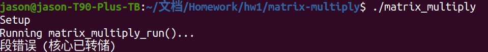

# 系统优化A1

### 环境配置

一开始我使用的是VMWare 创建一个Ubuntu 的虚拟机，但是当我勾选打开虚拟cpu计数器时虚拟机无法打开。报错信息如下：


查询了很多文档，发现不勾选是最直接的方法，但也不是完美的解决办法。通过郭腾说的方法，将Hyper-V、Microsoft Defender, Windows 沙盒等功能关闭后，也无法启动，于是装了个Ubuntu双系统。


将依赖安装完毕后，版本信息如上。

## 作业

### C-primer Pointer

#### Write-up 2:

Answer the questions in the comments in pointer.c. For example, why are some of the statements valid and some are not? 

```c
// Copyright (c) 2012 MIT License by 6.172 Staff

#include <stdio.h>
#include <stdlib.h>
#include <stdint.h>

int main(int argc, char * argv[]) {  // What is the type of argv?
  /*char * argv[] 其实这是一个指针数组，其元素个数是argc，存放的是指向每一个参数的指针*/
  int i = 5;
  // The & operator here gets the address of i and stores it into pi
  int * pi = &i;
  // The * operator here dereferences pi and stores the value -- 5 --
  // into j.
  int j = *pi;

  char c[] = "6.172";
  char * pc = c;  // Valid assignment: c acts like a pointer to c[0] here.
  char d = *pc;
  
  printf("char d = %c\n", d);  // What does this print?
  
  /*
  输出结果是 char d = 6
  因为 *pc 指的是 c[0]即6，而*pc由赋值给了d，因此d为6
  */

  // compound types are read right to left in C.
  // pcp is a pointer to a pointer to a char, meaning that
  // pcp stores the address of a char pointer.
  char ** pcp;
  pcp = argv;  // Why is this assignment valid?
  /*
  之前说argv是指针数组，而 pcp 是一个二级指针，指针数组可以直接赋值给二级指针。
  其中，argv是指向一个指针数组首元素的char*类型的指针
  对一个char* 指针的再引用就是 char**类型
  我们可以通过二级指针来遍历指针数组中的内容。
  */

  const char * pcc = c;  // pcc is a pointer to char constant
  char const * pcc2 = c;  // What is the type of pcc2?
  /*
 const char *pcc 是定义了一个指向字符常量的指针，pcc指向一个 char * 类型的常量，因此 *pcc的值不能修改但指针本身可以修改
 char const *pcc2 的类型也是一个指向字符常量的指针。
 printf("pcc2 = %c\n", *pcc2);
 printf("pcc = %c\n", *pcc); 
 它们打印的结果是一样的。
  */

  // For each of the following, why is the assignment:
  *pcc = '7';  // invalid?
  pcc = *pcp;  // valid?
  pcc = argv[0];  // valid?
  
  /*
	之前我们说过 *pcc 的值是不能修改的，因此   *pcc = '7' 会报错
	但是pcc是一个地址，这个地址是可以修改的，因此pcc = *pcp和pcc = argv[0]都合法
  */

  char * const cp = c;  // cp is a const pointer to char
  // For each of the following, why is the assignment:
  cp = *pcp;  // invalid?
  cp = *argv;  // invalid?
  *cp = '!';  // valid?
  /*
  定义一个指向字符的指针常数，即const指针，不能修改cp指针，但是可以修改该指针指向的内容。
  因此cp = *pcp或者cp = *argv都在修改指针本身，是不合法的
  而*cp修改的是指针指向的内容，是可修改的
  */
  

  const char * const cpc = c;  // cpc is a const pointer to char const
  // For each of the following, why is the assignment:
  cpc = *pcp;  // invalid?
  cpc = argv[0];  // invalid?
  *cpc = '@';  // invalid?
  
  /*
  cpc是指向字符常量的const指针
	在这种情况下，指针cpc以及它指向的值*cpc都是不能被修改的，因此下面三行代码都为非法。
  */
  return 0;
}
```

当我输入 `pointer.c` 的时候，报错结果如图，错误原因一些在上面的代码当中：


#### Write-up 3:

`sizes.c`

````c
int main() { 
  printf("size of %s : %zu bytes \n", "int", sizeof(int)); 
  typedef struct {
    int id;
    int year;
  } student;
  student you;
  you.id = 12345;
  you.year = 4;
  int x[5];
   printf("size of %s : %zu bytes \n", "int", sizeof(int));
    printf("size of %s : %zu bytes \n", "short", sizeof(short));
    printf("size of %s : %zu bytes \n", "long", sizeof(long));
    printf("size of %s : %zu bytes \n", "char", sizeof(char));
    printf("size of %s : %zu bytes \n", "float", sizeof(float));
    printf("size of %s : %zu bytes \n", "double", sizeof(double));
    printf("size of %s : %zu bytes \n", "unsigned int", sizeof(unsigned int));
    printf("size of %s : %zu bytes \n", "long long", sizeof(long long));
  	printf("size of %s : %zu bytes \n", "uint8_t", sizeof(uint8_t));
    printf("size of %s : %zu bytes \n", "uint16_t", sizeof(uint16_t));
    printf("size of %s : %zu bytes \n", "uint32_t", sizeof(uint32_t));
    printf("size of %s : %zu bytes \n", "uint64_t", sizeof(uint64_t));
    printf("size of %s : %zu bytes \n", "uint_fast8_t", sizeof(uint_fast8_t));
    printf("size of %s : %zu bytes \n", "uint_fast16_t", sizeof(uint_fast16_t));
    printf("size of %s : %zu bytes \n", "uintmax_t", sizeof(uintmax_t));
    printf("size of %s : %zu bytes \n", "intmax_t", sizeof(intmax_t));
    printf("size of %s : %zu bytes \n", "__int128", sizeof(__int128));
    printf("size of %s : %zu bytes \n", "uint32_t", sizeof(uint32_t));
    printf("size of %s : %zu bytes \n", "uint64_t", sizeof(uint64_t));
    printf("size of %s : %zu bytes \n", "student", sizeof(student));
    printf("size of %s : %zu bytes \n", "x", sizeof(x));
    printf("size of %s : %zu bytes \n", "int*", sizeof(int*));
    printf("size of %s : %zu bytes \n", "short*", sizeof(short*));
    printf("size of %s : %zu bytes \n", "long*", sizeof(long*));
    printf("size of %s : %zu bytes \n", "char*", sizeof(char*));
    printf("size of %s : %zu bytes \n", "float*", sizeof(float*));
    printf("size of %s : %zu bytes \n", "double*", sizeof(double*));
    printf("size of %s : %zu bytes \n", "unsigned int*", sizeof(unsigned int*));
  	printf("size of %s : %zu bytes \n", "long long*", sizeof(long long*));
    printf("size of %s : %zu bytes \n", "uint8_t*", sizeof(uint8_t*));
    printf("size of %s : %zu bytes \n", "uint16_t*", sizeof(uint16_t*));
    printf("size of %s : %zu bytes \n", "uint32_t*", sizeof(uint32_t*));
    printf("size of %s : %zu bytes \n", "uint64_t*", sizeof(uint64_t*));
    printf("size of %s : %zu bytes \n", "uint_fast8_t*", sizeof(uint_fast8_t*));
    printf("size of %s : %zu bytes \n", "uint_fast16_t*", sizeof(uint_fast16_t*));
    printf("size of %s : %zu bytes \n", "uintmax_t*", sizeof(uintmax_t*));
    printf("size of %s : %zu bytes \n", "intmax_t*", sizeof(intmax_t*));
    printf("size of %s : %zu bytes \n", "__int128*", sizeof(__int128*));
    printf("size of %s : %zu bytes \n", "uint32_t*", sizeof(uint32_t*));
    printf("size of %s : %zu bytes \n", "uint64_t*", sizeof(uint64_t*));
    printf("size of %s : %zu bytes \n", "student*", sizeof(student*));
    printf("size of %s : %zu bytes \n", "&x", sizeof(&x));
  return 0;
}
````

这道题让我们打印出不同数据类型的指针长度

`verifier.py` 检测如下


#### Write-up 4

这题让我们用指针重写swap函数，如下：

```c
void swap(int* i, int* j) {
    int t;
    t = *i;
    *i = *j;
    *j = t;
}

int main() {
  int x = 1;
  int y = 2;
  int *k=&x,*m=&y;
  swap(k, m);
  printf("k = %d, m = %d\n", x, y);
  return 0;
}

```

打印结果如下：


### Basic tools

#### Write-up 5

一开始输入make，如下：


发现是 -O1 

然后修改makefile，将O1改成O3


make clean -> make 之后：以 -O3 的方式优化


`./matrix_multiply` 之后，出现了segmentation fault：



#### Write-up 6

What output do you see from AddressSanitizer regarding the memory bug? Paste it into your writeup here 

```shell
Setup
Running matrix_multiply_run()...
=================================================================
==6175==ERROR: AddressSanitizer: heap-buffer-overflow on address 0x603000000120 at pc 0x0000004f99cb bp 0x7ffe0fdfe8d0 sp 0x7ffe0fdfe8c8
READ of size 8 at 0x603000000120 thread T0
    #0 0x4f99ca in matrix_multiply_run /home/jason/文档/Homework/hw1/matrix-multiply/matrix_multiply.c:90:46
    #1 0x4f8754 in main /home/jason/文档/Homework/hw1/matrix-multiply/testbed.c:134:3
    #2 0x7fc16c7bab6a in __libc_start_main (/lib/x86_64-linux-gnu/libc.so.6+0x26b6a)
    #3 0x41bea9 in _start (/home/jason/文档/Homework/hw1/matrix-multiply/matrix_multiply+0x41bea9)

0x603000000120 is located 0 bytes to the right of 32-byte region [0x603000000100,0x603000000120)
allocated by thread T0 here:
    #0 0x4c7853 in malloc /build/llvm-toolchain-8-F3l7P1/llvm-toolchain-8-8/projects/compiler-rt/lib/asan/asan_malloc_linux.cc:146:3
    #1 0x4f9330 in make_matrix /home/jason/文档/Homework/hw1/matrix-multiply/matrix_multiply.c:46:31
    #2 0x7fc16c7bab6a in __libc_start_main (/lib/x86_64-linux-gnu/libc.so.6+0x26b6a)

SUMMARY: AddressSanitizer: heap-buffer-overflow /home/jason/文档/Homework/hw1/matrix-multiply/matrix_multiply.c:90:46 in matrix_multiply_run
Shadow bytes around the buggy address:
  0x0c067fff7fd0: 00 00 00 00 00 00 00 00 00 00 00 00 00 00 00 00
  0x0c067fff7fe0: 00 00 00 00 00 00 00 00 00 00 00 00 00 00 00 00
  0x0c067fff7ff0: 00 00 00 00 00 00 00 00 00 00 00 00 00 00 00 00
  0x0c067fff8000: fa fa 00 00 00 00 fa fa 00 00 04 fa fa fa 00 00
  0x0c067fff8010: 04 fa fa fa 00 00 04 fa fa fa 00 00 04 fa fa fa
=>0x0c067fff8020: 00 00 00 00[fa]fa 00 00 00 00 fa fa fa fa fa fa
  0x0c067fff8030: fa fa fa fa fa fa fa fa fa fa fa fa fa fa fa fa
  0x0c067fff8040: fa fa fa fa fa fa fa fa fa fa fa fa fa fa fa fa
  0x0c067fff8050: fa fa fa fa fa fa fa fa fa fa fa fa fa fa fa fa
  0x0c067fff8060: fa fa fa fa fa fa fa fa fa fa fa fa fa fa fa fa
  0x0c067fff8070: fa fa fa fa fa fa fa fa fa fa fa fa fa fa fa fa
Shadow byte legend (one shadow byte represents 8 application bytes):
  Addressable:           00
  Partially addressable: 01 02 03 04 05 06 07 
  Heap left redzone:       fa
  Freed heap region:       fd
  Stack left redzone:      f1
  Stack mid redzone:       f2
  Stack right redzone:     f3
  Stack after return:      f5
  Stack use after scope:   f8
  Global redzone:          f9
  Global init order:       f6
  Poisoned by user:        f7
  Container overflow:      fc
  Array cookie:            ac
  Intra object redzone:    bb
  ASan internal:           fe
  Left alloca redzone:     ca
  Right alloca redzone:    cb
  Shadow gap:              cc
==6175==ABORTING
```

#### write-up7

valgrind是一种检测内存泄露的工具，首先： `$ make clean && make `, 然后 `$ valgrind ./matrix_multiply -p `结果如下：

```
==6258== Memcheck, a memory error detector
==6258== Copyright (C) 2002-2017, and GNU GPL'd, by Julian Seward et al.
==6258== Using Valgrind-3.14.0 and LibVEX; rerun with -h for copyright info
==6258== Command: ./matrix_multiply -p
==6258== 
Setup
Matrix A: 
------------
    3      7      8      1      7  
    9      8      3      1      2  
    6      7      9      8      1  
    9      1      3      0      1  
------------
Matrix B: 
------------
    5      5      7      8  
    0      1      9      8  
    9      3      1      7  
    0      7      0      3  
------------
//...
```

很明显从这个角度来看矩阵A和B是根本不可相乘的，究其原因在于当我们在创建矩阵A和B的时候没有对其做大小上的限制。

```c
 A = make_matrix(kMatrixSize, kMatrixSize);
 B = make_matrix(kMatrixSize, kMatrixSize);
```

将A的列数与B的行数相统一.

此外，我们发现这样直接运行会导致出现乱码的情况，如下图所示


这是因为在分配内存之后，一开始这片地址上是有值的，因此我们还需要到`matrix_multiply.c`上去初始化矩阵：

```c
matrix* make_matrix(int rows, int cols) {
  matrix* new_matrix = malloc(sizeof(matrix));

  // Set the number of rows and columns
  new_matrix->rows = rows;
  new_matrix->cols = cols;

  // Allocate a buffer big enough to hold the matrix.
  new_matrix->values = (int**)malloc(sizeof(int*) * rows);
  for (int i = 0; i < rows; i++) {
    new_matrix->values[i] = (int*)malloc(sizeof(int) * cols);
  }
    
    for(int i=0;i<rows;i++){
        for(int j = 0;j<cols;j++){
            new_matrix->values[i][j] =0;
        }
    }
    
  return new_matrix;
}
```

初始化后，结果正确


#### Write-up8

Paste the output from Valgrind showing that there is no error in your program 

虽然现在已经能够得出矩阵乘法的正确结果了，但是因为我们没有对申请的矩阵进行释放，因此valgrind还是会出现报错情况。

因此我们要在 `testbed.c`中对三个矩阵进行释放：

```c
    free_matrix(A);
    free_matrix(B);
    free_matrix(C);
```

结果如下，valgrind不再报错。


