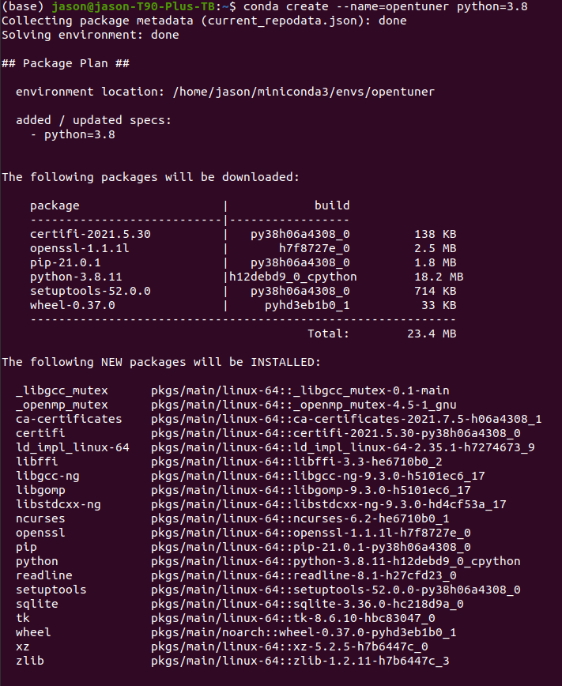

# 系统优化A2

 ## Task1

安装OpenTuner并记录执行过程，建议采用Development installation模式，了解安装依赖的方法。

项目地址：https://github.com/jansel/opentuner 

OpenTuner是一个新的框架，用于构建特定领域的多目标程序自动调谐器。OpenTuner支持完全可定制的配置表示、允许特定于域的技术的可扩展技术表示，以及用于与调优程序通信的易于使用的接口。OpenTuner内部的一个关键功能是同时使用各种不同的搜索技术，性能好的技术将获得更大的测试预算，性能差的技术将被禁用。

### 安装过程

这里有两种安装模式，一种是利用pip来安装opentuner，即`sudo pip install opentuner`;

还有一种是 Development installation ，即使用 miniconda3 来安装

```
conda create --name=opentuner python=3.8
conda activate opentuner
pip install -r requirements.txt -r optional-requirements.txt
python setup.py develop
```

那么首先我们要在这里下载miniconda：https://docs.conda.io/en/latest/miniconda.html

然后运行到最后Linux会问我们是否要初始化miniconda3，这其中的区别就是，当我选择了yes以后，在打开终端时自动执行conda activate root命令，这样在终端输入python的时候默认是python3。而选择no的话，在安装完anaconda后需手动添加环境变量。因此我们还是选择yes。


安装完以后，重启shell就发现已经是python3环境了。

现在我们来创建一个名叫做opentuner的python3.8环境：




## Task2

 阅读论文《OpenTuner: An Extensible Framework for Program Autotuning》，理解其主要思想。

论文地址：http://groups.csail.mit.edu/commit/papers/2014/ansel-pact14-opentuner.pdf 

讲义地址：http://groups.csail.mit.edu/commit/papers/2014/ansel-pact14-opentuner-slides.pdf 


## Task3

练习Optimizing Block Matrix Multiplication教程并记录执行过程和结果，了解开源项目开发和维护流程。

教程地址：http://opentuner.org/tutorial/gettingstarted/ 

注意：如遇程序执行错误（Bugs），请检查和修复错误，并记录该错误及其修复过程。


